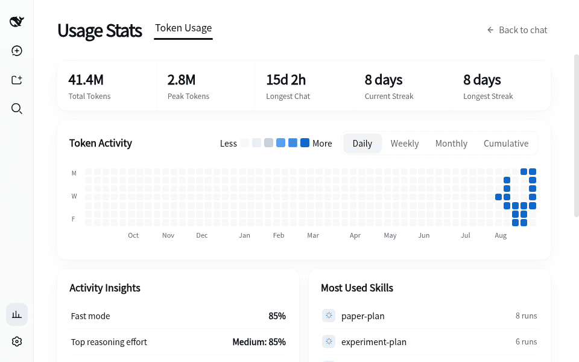
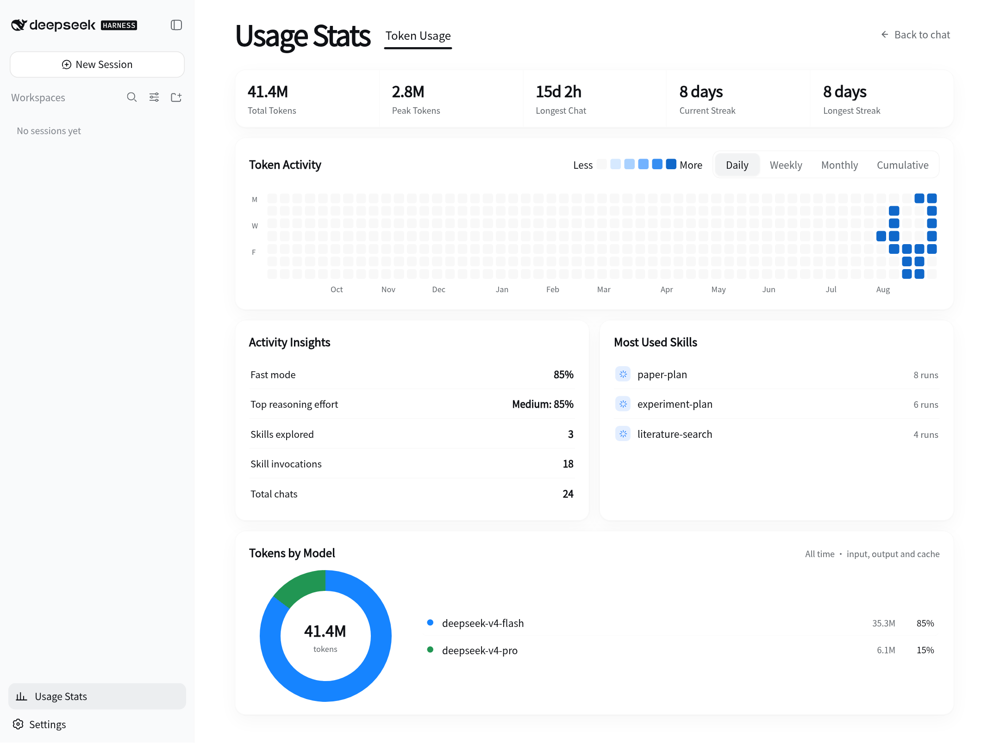
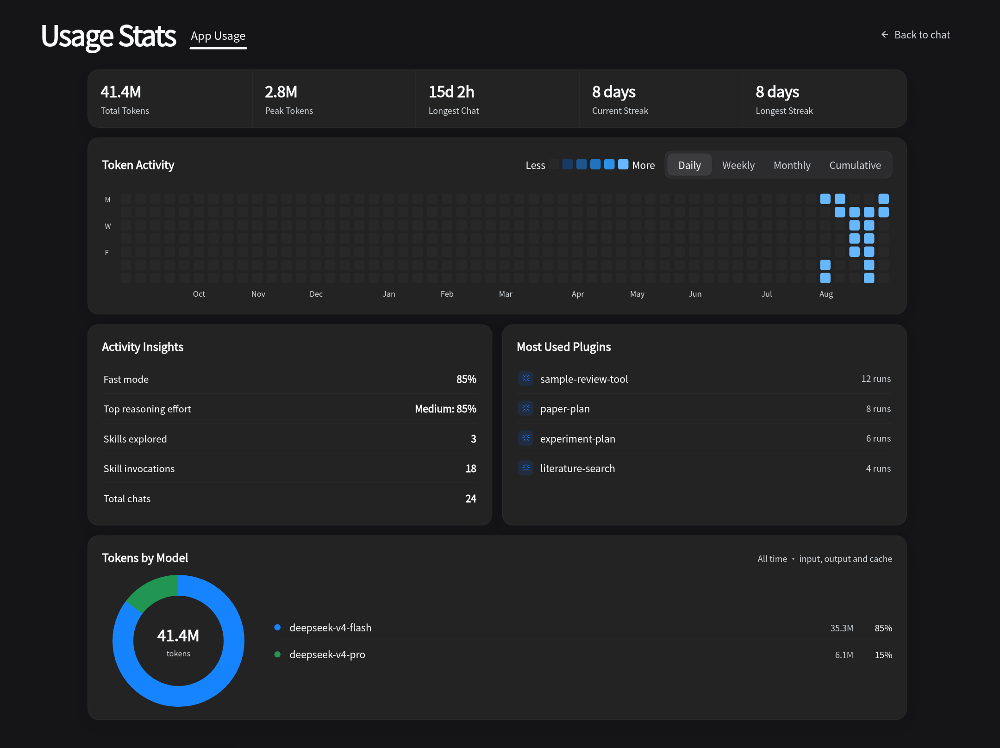

# 📊 dsh-usage-stats

[English](./README.en.md)

> DeepSeek Harness Token 使用情况，一目了然。

[](https://www.npmjs.com/package/dsh-usage-stats)
[](https://www.npmjs.com/package/dsh-usage-stats)
[](https://github.com/lanlandeli/dsh-usage-stats/actions)
[](https://nodejs.org)
[](./LICENSE)

dsh-usage-stats 是面向 DeepSeek Harness Web UI 的轻量使用统计插件，提供活动看板：累计 / 峰值 Token、最长聊天时长、连续活跃天数、每日 / 每周 / 每月 / 累计 Token 活动热力图、活动洞察（快速模式、推理强度、技能使用）、最常用的技能与模型 Token 占比。

插件通过 Harness 提供的扩展接口集成，不修改 Web UI 或官方 npm 包。统计数据保存在本机。

```sh
dsh plugin --profile web add dsh-usage-stats
```

重启 Web Profile 后，侧边栏「设置」上方会出现 **使用统计**。

更新或卸载：

```sh
dsh plugin --profile web update dsh-usage-stats
dsh plugin --profile web remove dsh-usage-stats
```

其他安装方式：

```sh
# 一行安装脚本（macOS / Linux / Windows Git Bash）
curl -fsSL https://raw.githubusercontent.com/lanlandeli/dsh-usage-stats/main/scripts/install.sh | bash
```

或在 Web 界面中：**设置 → 插件市场**（`dshmarket` 插件）→ 搜索 `dsh-usage-stats` 一键安装。

## 🎬 效果演示



## 🖼️ 界面截图

<details>
<summary>查看浅色主题</summary>



</details>

<details>
<summary>查看深色主题</summary>



</details>

## ✨ 功能概览

| 模块 | 说明 |
| --- | --- |
| 📊 **核心指标** | 累计 Token、峰值 Token（单日最高）、最长聊天时长、当前 / 最长连续天数 |
| 🔥 **Token 活动** | 近 53 周活动视图，支持每日热力图 / 每周 / 每月 / 累计曲线四种切换 |
| 💡 **活动洞察** | 快速模式占比、最常用推理强度、已探索技能数、技能使用总数、聊天总数 |
| 🧩 **常用技能** | 按运行次数排序的最常用技能 Top 5 |
| 🥧 **模型占比** | 按模型统计 Token 占比的环形图与图例 |
| 💾 **数据导出** | 支持导出 CSV 或 JSON，用于归档或进一步分析 |
| 🌐 **中英文界面** | 自动跟随 Harness 的语言设置切换中文或英文 |
| 🎨 **主题适配** | 自动跟随 Harness 的浅色或深色主题 |
| ⚡ **轻量运行** | 无第三方图表库、无后台轮询，减少额外的网络请求与运行开销 |

## ✅ 已修复

### 官方模块重复安装风险

`0.1.16` 将插件使用的 DeepSeek Harness 官方模块统一声明为对等依赖，避免 Profile 内出现插件私有副本及模块身份分裂。发布检查会阻止官方模块再次进入普通依赖。

### 子任务继承上下文重复计入

`0.1.13` 修复了 fork 子任务将父会话继承上下文重复计入自身用量的问题。子任务现在只统计自身产生的调用；升级后，旧版统计缓存会自动失效并按新口径重建。

## ⚙️ 配置

```yaml
config:
  indexConcurrency: 2
  cacheWriteDelayMs: 1000
  apiPath: /usage-stats/v1
  fastModelPattern: flash|turbo|lite|nano|haiku|fast|mini
```

| 配置项 | 说明 | 默认值 |
| --- | --- | --- |
| `indexConcurrency` | 同时读取历史会话的数量（`1`–`8`） | `2` |
| `cacheWriteDelayMs` | 更新本地统计前的等待时间（毫秒） | `1000` |
| `cachePath` | 自定义统计缓存位置 | Harness 数据目录 |
| `apiPath` | 统计接口路径 | `/usage-stats/v1` |
| `fastModelPattern` | 判定"快速模型"的模型名正则（不区分大小写），用于活动洞察的快速模式占比 | `flash\|turbo\|lite\|nano\|haiku\|fast\|mini` |

## 📡 数据接口

插件在 Harness Web 同源地址上暴露一组**只读** HTTP 接口（默认基路径 `/usage-stats/v1`，可通过 `apiPath` 配置），供其他插件或外部工具消费：

| 端点 | 说明 |
| --- | --- |
| `GET /snapshot` | 聚合看板数据（查询参数：`from`、`to`、`timeZone`、`scope`、`workspace`） |
| `GET /calls` | 调用级明细分页（支持模型 / 提供方 / Token 阈值过滤） |
| `GET /export.csv` | 下载当前查询区间的 CSV |
| `GET /export.json` | 下载当前查询区间的 JSON |

参数、响应结构与错误约定见 [接口文档](./docs/API.md)。`v1` 路径向后兼容（只增不改）；破坏性变更将启用新版本路径。

## 🔒 隐私与安全

- 统计索引保存在 `DSH_HOME/usage-stats`，内容包括会话标识、时间、工作目录、模型名称和 Token 数量。
- 插件**不保存**提示词正文、回复正文、工具参数或 API 密钥。
- 具体记录范围见 [隐私说明](./PRIVACY.md)。

## 🧩 兼容性

目前已在 DeepSeek Harness `0.1.0-rc.6`、`0.1.1-rc.2`、Node.js `22.19+` 和 `24+` 上测试，可用于官方 Web UI，以及加载该 Web UI 的桌面封装。

Harness 仍在持续更新。本文仅声明经过实际测试的运行环境；其他版本可能可以正常运行，但不在当前验证范围内。详细信息见 [兼容性说明](./docs/COMPATIBILITY.md)。

## 🐛 遇到问题

如果出现插件入口缺失、统计结果不完整、界面显示异常或版本兼容问题，请 [提交 Issue](https://github.com/lanlandeli/dsh-usage-stats/issues/new)。

提交时请尽量附上：

- DeepSeek Harness 和 Node.js 版本；
- 安装或更新插件时执行的命令；
- 可复现问题的操作步骤；
- 错误日志或界面截图。

完整的环境信息和复现步骤有助于定位问题。涉及安全问题时，请勿在公开 Issue 中提交 API 密钥、访问令牌或本机数据，报告方式见 [安全策略](./SECURITY.md)。

## 🙏 致谢

- 感谢 [@Grivn](https://github.com/Grivn) 在 [#1](https://github.com/lanlandeli/dsh-usage-stats/pull/1) 中发现并分析子任务继承上下文重复统计问题。
- 感谢 [@yzke](https://github.com/yzke) 在 [#2](https://github.com/lanlandeli/dsh-usage-stats/pull/2) 中提出并实现中英文界面适配方案。
- 感谢 [@ogj130](https://github.com/ogj130) 在 [#3](https://github.com/lanlandeli/dsh-usage-stats/pull/3) 中贡献调用明细功能的初始实现。
- 感谢 [@zhu637882-stack](https://github.com/zhu637882-stack) 在 [#4](https://github.com/lanlandeli/dsh-usage-stats/issues/4) 中报告官方模块重复安装风险。

## 📜 许可证

[MIT](./LICENSE)
